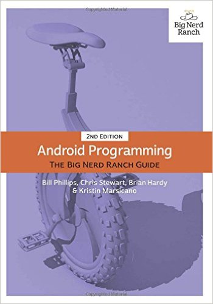

# BigNerdRanch-Android

This repo contains my implementation of the book **Android Programming: The Big Nerd Ranch Guide** on its second edition.

The result of following every chapter of the book can be found on its own branch. Once a chapter is completed, it wil be merged to master which eventually will containt the final result of the book.

Content (Roadmap)
=================

* Chapter 1 - Your First Android Application ✅
* Chapter 2 - Android and Model-View-Controller ✅
* Chapter 3 - The Activity Lifecycle ✅
* Chapter 4 - Debugging Android Apps ✅
* Chapter 5 - Your Second Activity ✅
* Chapter 6 - Android SDK Versions and Compatibility ✅
* Chapter 7 - UI Fragments and the Fragment Manager ✅
* Chapter 8 - Creating User Interfaces with Layouts and Widgets - *Work in Progress (Branch Chapter-8-CreatingUserInterfacesWithLayoutsAndWidgets)*
* Chapter 9 - Displaying Lists with RecyclerView
* Chapter 10 - Using Fragments Arguments
* Chapter 11 - Using ViewPager
* Chapter 12 - Dialogs
* Chapter 13 - The Toolbar
* Chapter 14 - SQLite Databases
* Chapter 15 - Implicit Intents
* Chapter 16 - Taking Pictures with Intents
* Chapter 17 - Two-Pane Master-Detail Interfaces
* Chapter 18 - Assets
* Chapter 19 - Audio Playback with SoundPool
* Chapter 20 - Styles and Themes
* Chapter 21 - XML Drawables
* Chapter 22 - More About Intents and Tasks
* Chapter 23 - HTTP & Background Tasks
* Chapter 24 - Loopers, Handlers, and HandlerThread
* Chapter 25 - Search
* Chapter 26 - Background Services
* Chapter 27 - Broadcast Intents
* Chapter 28 - Browsing the Web and WebView
* Chapter 29 - Custom Views and Touch Events
* Chapter 30 - Property Animation
* Chapter 31 - Locations and Play Services
* Chapter 32 - Maps
* Chapter 33 - Material Design
* Chapter 34 - Afterword

